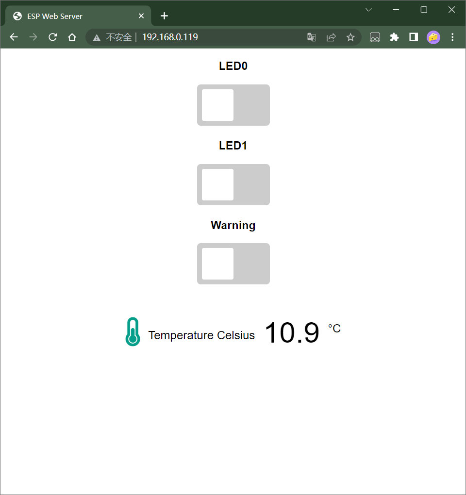

# 基于Arduino的ESP32服务器的温度采集显示与LED远程控制

## 前言

&ensp;建立一个异步ESP32 Web Server实时接收来自串口1 `Serial1`的发送的温度值数据，并在ESP32托管网页上实时显示当前温度值，Web客户端可以发送指令至串口1 `Serial1`远程控制LED。

## 先前准备

### 1.ESP32开发板+USB供电线+(C51/STM32:用于采集温度值+控制LED)

&ensp;当然，我们也可以不通过C51/STM32去做温度值采集、LED控制，直接通过ESP32就可以完成这些。笔者使用这些，只是某个实习项目必须要求的。

### 2.开发环境Arduino+VSCode+PlatformIO

&ensp;开发环境配置就不在此赘述，google上有相关教程，在此[附上一个](https://randomnerdtutorials.com/vs-code-platformio-ide-esp32-esp8266-arduino/)。

### 3.依赖库安装

&ensp;[ESPAsyncWebServer](https://github.com/me-no-dev/ESPAsyncWebServer) 和 [AsyncTCP](https://github.com/me-no-dev/AsyncTCP) 库。

使用异步Web Server优势：

1.可以处理多个连接

2.当发送请求同时，可以处理其他请求连接

3.处理请求模板更简单

## 网页界面

&ensp;ESP32网页客户端界面如下：


## 代码架构

&ensp;主要文件在./src中。

### main.hpp

```C++
#ifndef MAIN_HPP
#define MAIN_HPP

#include <WiFi.h>

struct WiFiConfig
{
    /* data */
    const char *ssid;
    const char *password;
};

struct ParamConfig
{
    /* data */
    const char *PARAM_INPUT_1;
    const char *PARAM_INPUT_2;
};

String read_uart_data();
String processor(const String &var);
void server_request();

#endif
```

### main.cpp
```C++
/*
    Srerial串口：
    DEBUG用

    Serial1串口IO口:
    RX --------- SD2
    TX --------- SD3
*/

#include "main.hpp"
#include "WiFi.h"
#include "AsyncTCP.h"
#include "ESPAsyncWebServer.h"

WiFiConfig mywifi = {
    "dxxy16-402-1",
    "dxxy16402"};

ParamConfig param = {
    "output",
    "state"};

char recv_num[100];

// Create AsyncWebServer object on port 80
AsyncWebServer server(80);

const char index_html[] PROGMEM = R"rawliteral(
<!DOCTYPE HTML>
<html>

<head>
    <title>ESP Web Server</title>
    <meta name="viewport" content="width=device-width, initial-scale=1">
    <link rel="icon" href="data:,">
    <link rel="stylesheet" href="https://use.fontawesome.com/releases/v5.7.2/css/all.css"
        integrity="sha384-fnmOCqbTlWIlj8LyTjo7mOUStjsKC4pOpQbqyi7RrhN7udi9RwhKkMHpvLbHG9Sr" crossorigin="anonymous">
    <style>
        html {
            font-family: Arial;
            display: inline-block;
            text-align: center;
            margin: 0px auto;
        }

        h2 {
            font-size: 3.0rem;
        }

        p {
            font-size: 3.0rem;
        }

        body {
            max-width: 600px;
            margin: 0px auto;
            padding-bottom: 25px;
        }

        .switch {
            position: relative;
            display: inline-block;
            width: 120px;
            height: 68px
        }

        .switch input {
            display: none
        }

        .slider {
            position: absolute;
            top: 0;
            left: 0;
            right: 0;
            bottom: 0;
            background-color: #ccc;
            border-radius: 6px
        }

        .slider:before {
            position: absolute;
            content: "";
            height: 52px;
            width: 52px;
            left: 8px;
            bottom: 8px;
            background-color: #fff;
            -webkit-transition: .4s;
            transition: .4s;
            border-radius: 3px
        }

        input:checked+.slider {
            background-color: #b30000
        }

        input:checked+.slider:before {
            -webkit-transform: translateX(52px);
            -ms-transform: translateX(52px);
            transform: translateX(52px)
        }

        .units {
            font-size: 1.2rem;
        }

        .ds-labels {
            font-size: 1.2rem;
            vertical-align: middle;
            padding-bottom: 15px;
        }
    </style>
</head>

<body>
    %BUTTONPLACEHOLDER%

    <p>
        <i class="fas fa-thermometer-half" style="color:#059e8a;"></i>
        <span class="ds-labels">Temperature Celsius</span>
        <span id="temperaturec">%TEMPERATUREC%</span>
        <sup class="units">&deg;C</sup>
    </p>

    <script>
        function toggleCheckbox(element) {
            var xhr = new XMLHttpRequest();
            if (element.checked) { xhr.open("GET", "/update?output=" + element.id + "&state=1", true); }
            else { xhr.open("GET", "/update?output=" + element.id + "&state=0", true); }
            xhr.send();
        }

        setInterval(function () {
            var xhttp = new XMLHttpRequest();
            xhttp.onreadystatechange = function () {
                if (this.readyState == 4 && this.status == 200) {
                    document.getElementById("temperaturec").innerHTML = this.responseText;
                }
            };
            xhttp.open("GET", "/temperaturec", true);
            xhttp.send();
        }, 20000);
    </script>
</body>

</html>
)rawliteral";

void setup()
{
    Serial.begin(9600);
    Serial1.begin(9600);

    // Connect to Wi-Fi
    WiFi.begin(mywifi.ssid, mywifi.password);
    while (WiFi.status() != WL_CONNECTED)
    {
        delay(1000);
        Serial.println("Connecting to WiFi..");
    }

    // Print ESP Local IP Address
    Serial.println(WiFi.localIP());

    server_request();
}

void loop()
{
}

void server_request()
{
    // Route for root / web page
    server.on("/", HTTP_GET, [](AsyncWebServerRequest *request)
              { request->send_P(200, "text/html", index_html, processor); });

    // Send a GET request to <ESP_IP>/update?output=<inputMessage1>&state=<inputMessage2>
    server.on("/update", HTTP_GET, [](AsyncWebServerRequest *request)
              {
        String inputMessage1;
        String inputMessage2;
        // GET input1 value on <ESP_IP>/update?output=<inputMessage1>&state=<inputMessage2>
        if (request->hasParam(param.PARAM_INPUT_1) && request->hasParam(param.PARAM_INPUT_2)) {
            inputMessage1 = request->getParam(param.PARAM_INPUT_1)->value();
            inputMessage2 = request->getParam(param.PARAM_INPUT_2)->value();
        }
        else {
            inputMessage1 = "No message sent";
            inputMessage2 = "No message sent";
        }
        Serial.print(inputMessage1+inputMessage2);
        Serial1.print(inputMessage1+inputMessage2);

        request->send(200, "text/plain", "OK"); });

    server.on("/temperaturec", HTTP_GET, [](AsyncWebServerRequest *request)
              { request->send_P(200, "text/plain", read_uart_data().c_str()); });

    // Start server
    server.begin();
}

// 读取串口数据
String read_uart_data()
{
    unsigned short i = Serial1.available(); // 获取串口接收数据个数
    unsigned short count = i;
    unsigned short j;
    char temp;

    if (i != 0)
    {
        j = 0;
        memset(recv_num, 0, sizeof(recv_num)); // 清空我们的目标字符串存储区域
        while (i--)
        {
            /* code */
            temp = Serial1.read();
            if (temp == '?')
                break;
            if (temp == 'C')
                break;
            recv_num[j] = temp;
            j++;
        }
        // Serial1.print(recv_num);
    }
    else
    {
        NULL;
    }

    // DEBUG
    Serial.print(recv_num);
    return String(recv_num);
}

// Replaces placeholder with button section in your web page
String processor(const String &var)
{
    // Serial.println(var);
    if (var == "BUTTONPLACEHOLDER")
    {
        String buttons = "";
        buttons += "<h3>LED0</h3><label class=\"switch\"><input type=\"checkbox\" onchange=\"toggleCheckbox(this)\" id=\"0\"><span class=\"slider\"></span></label>";
        buttons += "<h3>LED1</h3><label class=\"switch\"><input type=\"checkbox\" onchange=\"toggleCheckbox(this)\" id=\"1\"><span class=\"slider\"></span></label>";
        buttons += "<h3>Warning</h3><label class=\"switch\"><input type=\"checkbox\" onchange=\"toggleCheckbox(this)\" id=\"2\"><span class=\"slider\"></span></label>";
        return buttons;
    }
    if (var == "TEMPERATUREC")
    {
        return read_uart_data();
    }
    return String();
}
```
### 代码如何运作
1.首先，包含必要的库：
```C++
#include "main.hpp"
#include "WiFi.h"
#include "AsyncTCP.h"
#include "ESPAsyncWebServer.h"
```

2.定义所需的变量和结构体变量：
```C++
WiFiConfig mywifi = {
    "dxxy16-402-1",
    "dxxy16402"};

ParamConfig param = {
    "output",
    "state"};

char recv_num[100];
```

3.创建一个`异步网络服务器`的`server`对象监听`80`端口
```C++
AsyncWebServer server(80);
```

4.process()函数
&ensp;process()函数会将值赋在我们创建的HTML网页上的占位符上。它接受占位符(`"BUTTONPLACEHOLDER"`和`"TEMPERATUREC"`)作为参数，并返回一个替代占位符的字符串。
```C++
String processor(const String &var)
{
    // Serial.println(var);
    if (var == "BUTTONPLACEHOLDER")
    {
        String buttons = "";
        buttons += "<h3>LED0</h3><label class=\"switch\"><input type=\"checkbox\" onchange=\"toggleCheckbox(this)\" id=\"0\"><span class=\"slider\"></span></label>";
        buttons += "<h3>LED1</h3><label class=\"switch\"><input type=\"checkbox\" onchange=\"toggleCheckbox(this)\" id=\"1\"><span class=\"slider\"></span></label>";
        buttons += "<h3>Warning</h3><label class=\"switch\"><input type=\"checkbox\" onchange=\"toggleCheckbox(this)\" id=\"2\"><span class=\"slider\"></span></label>";
        return buttons;
    }
    if (var == "TEMPERATUREC")
    {
        return read_uart_data();
    }
    return String();
}
```

5.read_uart_data()函数
&ensp;read_uart_data()函数用来将读取串口接受的数据，在本项目中，用于接收串口1发送的温度值数据。
```C++
String read_uart_data()
{
    unsigned short i = Serial1.available(); // 获取串口接收数据个数
    unsigned short count = i;
    unsigned short j;
    char temp;

    if (i != 0)
    {
        j = 0;
        memset(recv_num, 0, sizeof(recv_num)); // 清空我们的目标字符串存储区域
        while (i--)
        {
            /* code */
            temp = Serial1.read();
            if (temp == '?')
                break;
            if (temp == 'C')
                break;
            recv_num[j] = temp;
            j++;
        }
        // Serial1.print(recv_num);
    }
    else
    {
        NULL;
    }

    // DEBUG
    Serial.print(recv_num);
    return String(recv_num);
}
```

6.server_request()函数
&ensp;server_request()函数主要用来处理Web服务器请求并启动服务器。
```C++
void server_request()
{
    // Route for root / web page
    server.on("/", HTTP_GET, [](AsyncWebServerRequest *request)
              { request->send_P(200, "text/html", index_html, processor); });

    // Send a GET request to <ESP_IP>/update?output=<inputMessage1>&state=<inputMessage2>
    server.on("/update", HTTP_GET, [](AsyncWebServerRequest *request)
              {
        String inputMessage1;
        String inputMessage2;
        // GET input1 value on <ESP_IP>/update?output=<inputMessage1>&state=<inputMessage2>
        if (request->hasParam(param.PARAM_INPUT_1) && request->hasParam(param.PARAM_INPUT_2)) {
            inputMessage1 = request->getParam(param.PARAM_INPUT_1)->value();
            inputMessage2 = request->getParam(param.PARAM_INPUT_2)->value();
        }
        else {
            inputMessage1 = "No message sent";
            inputMessage2 = "No message sent";
        }
        Serial.print(inputMessage1+inputMessage2);
        Serial1.print(inputMessage1+inputMessage2);

        request->send(200, "text/plain", "OK"); });

    server.on("/temperaturec", HTTP_GET, [](AsyncWebServerRequest *request)
              { request->send_P(200, "text/plain", read_uart_data().c_str()); });

    // Start server
    server.begin();
}
```

7.setup()函数
&ensp;主要用串口的波特率初始化，wifi的连接以及网页服务器的请求与开启。
```C++
void setup()
{
    Serial.begin(9600);
    Serial1.begin(9600);

    // Connect to Wi-Fi
    WiFi.begin(mywifi.ssid, mywifi.password);
    while (WiFi.status() != WL_CONNECTED)
    {
        delay(1000);
        Serial.println("Connecting to WiFi..");
    }

    // Print ESP Local IP Address
    Serial.println(WiFi.localIP());

    server_request();
}
```